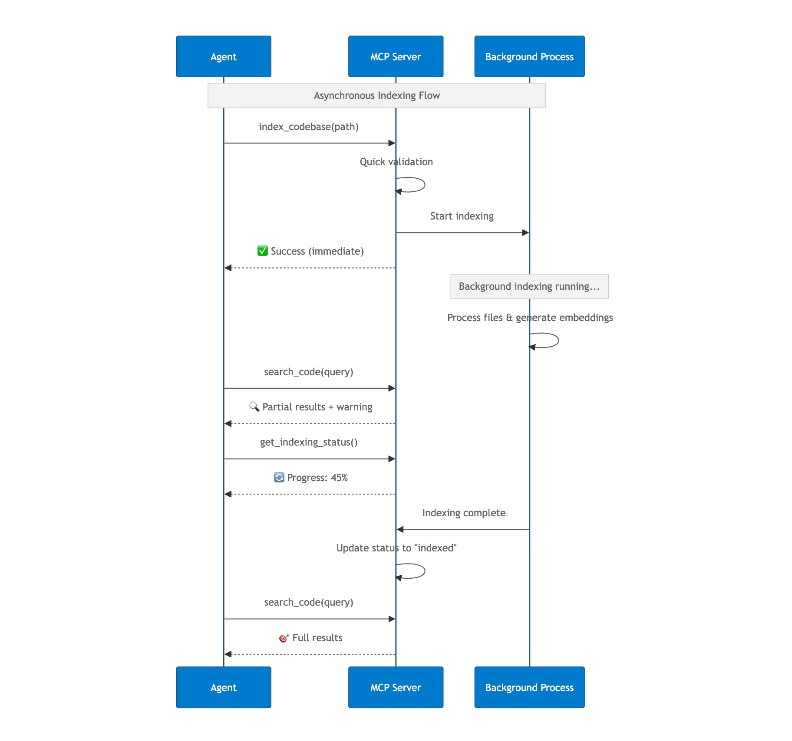
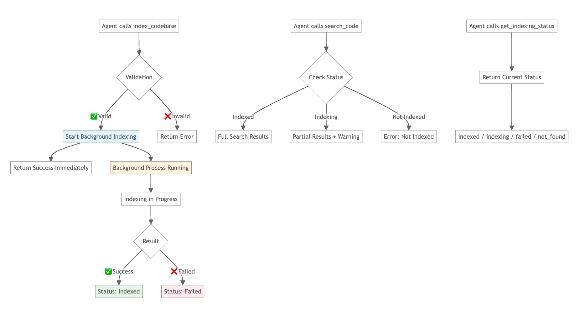

# Asynchronous Indexing Workflow

This document explains how Claude Context MCP handles codebase indexing asynchronously in the background.

## Core Concept

Claude Context MCP server allows users to start indexing and get an immediate response, while the actual indexing happens in the background. Users can search and monitor progress at any time.

## How It Works

The sequence diagram above demonstrates the timing and interaction between the agent, MCP server, and background process. 

The agent receives an immediate response when starting indexing, then the users can perform searches and status checks through the agent while indexing continues in the background.

## State Flow

The flow diagram above shows the complete indexing workflow, illustrating how the system handles different states and user interactions. The key insight is that indexing starts immediately but runs in the background, allowing users to interact with the system at any time.

## MCP Tools

- **`index_codebase`** - Starts background indexing, returns immediately
- **`search_code`** - Searches codebase (works during indexing with partial results)
- **`get_indexing_status`** - Shows current progress and status
- **`clear_index`** - Removes indexed data

## Status States

- **`indexed`** - ✅ Ready for search
- **`indexing`** - 🔄 Background process running
- **`indexfailed`** - ❌ Error occurred, can retry
- **`not_found`** - ❌ Not indexed yet

## How Progress Is Calculated

`get_indexing_status` reports a **coarse, phase-based percentage**, not an exact fraction of files completed.

- **0%** - Preparing the target collection and validating indexing prerequisites
- **~5%** - Scanning the codebase and building the file list
- **10% → 100%** - Processing files, chunking code, generating embeddings, and writing batches to the vector database
- **100%** - Indexing finished successfully

This means it is normal for indexing to jump to around `10%` quickly on a large codebase. It reflects a transition from setup phases into file processing, not that exactly one tenth of all files are already indexed.

Progress is also persisted periodically to the local MCP snapshot file at `~/.context/mcp-codebase-snapshot.json`, so very fast phases may appear as jumps rather than smooth increments.

## When File and Chunk Counts Appear

`get_indexing_status` shows file and chunk totals after a run has completed and the final statistics have been written to the local snapshot.

During active indexing, the MCP server tracks progress percentage, but it does **not** stream live file/chunk totals through `get_indexing_status`.

If you see an indexed entry with `0 files, 0 chunks`, that usually means the local snapshot metadata is stale or was created by an older / incomplete bookkeeping path. It is not a live count fetched from the vector database at status-check time.

To refresh those stored totals, clear and re-index the **same absolute path**.

## How Codebases Are Identified

Claude Context tracks codebases by their resolved **absolute path**.

- The MCP tools resolve relative paths to absolute paths before indexing, searching, clearing, or checking status.
- Collection identity is derived from the normalized absolute path.
- If you index the same repository through different absolute paths (for example, a symlink, a different clone, or a mounted path), Claude Context treats them as separate codebases.

For the most predictable behavior, always use the same absolute path for `index_codebase`, `search_code`, `clear_index`, and `get_indexing_status`.

## Key Benefits

- **Non-blocking**: Agent gets immediate response
- **Progressive**: Can search partial results while indexing
- **Resilient**: Handles errors gracefully with retry capability
- **Transparent**: Always know current status
